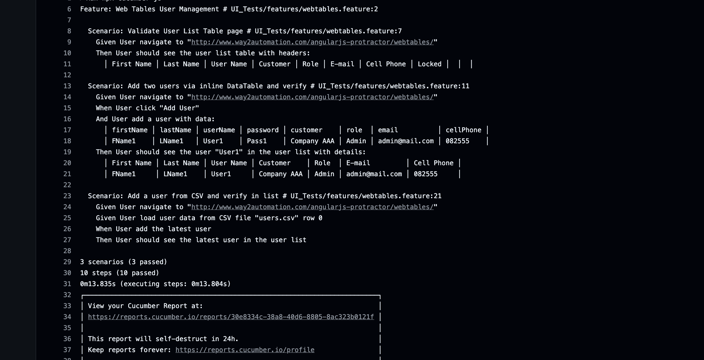

# Project: ABSA Assessment Playwright & API Automation

This repository contains end-to-end automation for both UI and API testing of the Petfinder application, as well as performance/load testing using k6. It is structured into distinct modules for maintainability and scalability.

### Key Components
- **UI Tests**: Built with Playwright and Cucumber.js to validate web table user management flows.
- **API Tests**:
  - **Mocked**: Jest + axios-mock-adapter for isolated unit tests of API interactions.
  - **Real**: Jest + axios + querystring for integration tests against the live Petfinder API.
- **Performance Tests**: k6 scripts to simulate load and validate performance thresholds.
- **CI/CD Workflows**: GitHub Actions YAML files to automate test runs on push, pull request, and scheduled triggers.

---

## Setup Instructions

1. **Clone the Repository**
   ```bash
   git clone https://github.com/skywalkerkabza/absa-assessment-playwright-javascript.git
   cd absa-assessment-playwright-javascript
   ```

2. **Install Dependencies**
   ```bash
   npm install
   ```

3. **Install Playwright Browsers**
   ```bash
   npx playwright install --with-deps
   ```


---

## How to Run the Tests

### UI Tests (Playwright + Cucumber)
```bash
npm run Test_UI
```  
- Generates reports in `test-results/ui-test-results/`  
- Videos and screenshots are recorded per scenario in `test-results/ui-test-results/videos` and `.../screenShots`.

### API Tests (Jest)
- **Mocked API**:
  ```bash
  npm run Test_API_Mocked
  ```  
- **Real API**:
  ```bash
  npm run Test_API_Real
  ```  
- **All API Tests**:
  ```bash
  npm run Test_ALL_API
  ```  
- Reports are generated under `test-results/api-test-results/`.

### Performance Tests (k6)
```bash
npm run Test_API_K6
```  
- Summary output to console and JSON in `load-test-results/summary.json`.

---


---

## Assumptions & Decisions
- **Language/Framework**: Chose JavaScript (CommonJS) for consistency with existing tools (Playwright, Jest, k6).
- **Structure**: Segregated UI, API, and performance tests into separate folders for clarity.
- **Reporting**: Adopted standard reporters (HTML, JSON) to integrate with pipelines and dashboards.
- **Credentials**: Hard-coded placeholders should be replaced with environment variables or secrets in CI.
- **Resource Cleanup**: Playwright contexts record video and screenshots per scenario, ensuring easy debugging.

---

## Tools & Resources Used
- **Node.js & NPM**: Dependency management and scripting.
- **Playwright (@playwright/test)**: Browser automation and UI testing.
- **Cucumber.js (@cucumber/cucumber)**: BDD framework for feature-driven tests.
- **Jest**: JavaScript testing framework for API unit and integration tests.
- **axios & axios-mock-adapter**: HTTP client and mocking for API tests.
- **k6**: Performance/load testing.
- **GitHub Actions**: CI/CD orchestration.
- **csv-parse**: CSV parsing for data-driven UI tests.

---



3 scenarios (3 passed)
10 steps (10 passed)
0m13.835s (executing steps: 0m13.804s)
┌──────────────────────────────────────────────────────────────────────────┐
│ View your Cucumber Report at:                                            │
│ https://reports.cucumber.io/reports/30e8334c-38a8-40d6-8805-8ac323b0121f │
│                                                                          │
│ This report will self-destruct in 24h.                                   │
│ Keep reports forever: https://reports.cucumber.io/profile                │
└──────────────────────────────────────────────────────────────────────────┘
